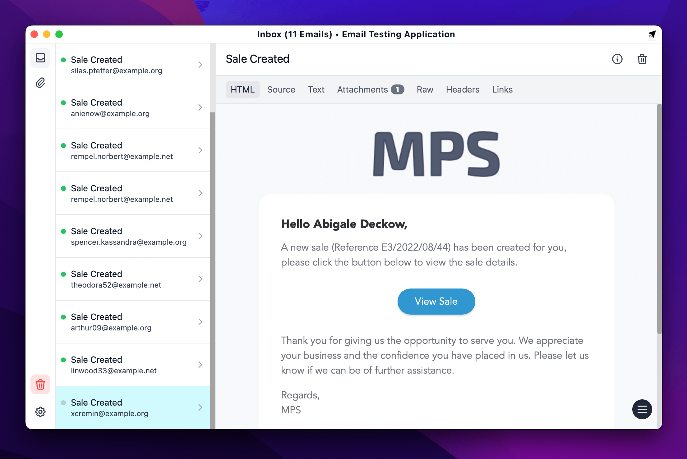

<!-- Email Testing Application -->
 

  

<h3 align="center">Email Testing Application</h3>

  

    Local Email Testing on Linux, MacOS & Windows
     
     
    <a href="https://tecdiary.net/download/email-testing-app">Download</a>
    ·
    <a href="https://github.com/Tecdiary/EmailTestingApp/issues/new">Report Bug</a>
    ·
    <a href="https://github.com/Tecdiary/EmailTestingApp/discussions/new?category=general">Request Feature</a>
    <!-- ·
    <a href="https://github.com/Tecdiary/EmailTestingApp/discussions/new?category=ideas">Share Idea</a> -->
  

Email Testing App exposes an SMTP server and catches the outgoing emails from your application so that you can check HTML, Attachments, Links, and Spam score.

## Getting Started

Email Testing Application has simple design that make it easy for everyone to get along and start testing emails in seconds.

Install the app and get the configuration for your SMTP or Framework from settings, configure you applications, and start sending emails.

### Previews to ensure

Previews emails to ensure they looks the way you intended, HTML representation, text, source code, raw, headers - we got you covered.

### Spam Score

If activated, Email Testing App checks the Spam Score of your incoming emails, thanks to spamcheck.postmarkapp.com

### Broken Link Checker

The automated link check verifies that all links in an email are valid and return an HTTP 200 status code. Don't send emails with broken links again.
